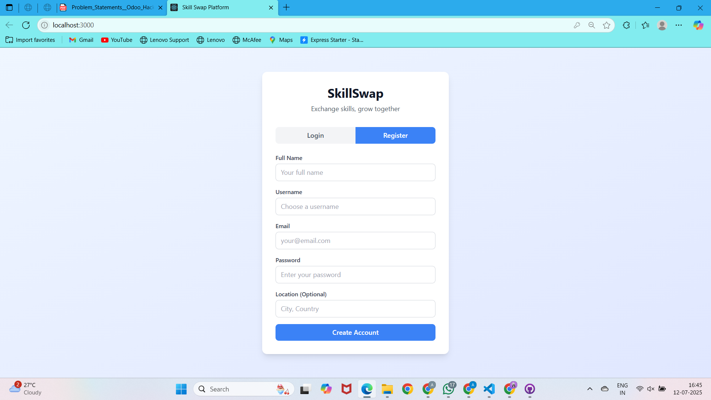

# Skill Swap Platform 🌟

## Overview
The **Skill Swap Platform** is a web application that allows users to exchange skills with one another. Users can list skills they offer, request skills they want to learn, and connect with others to arrange skill swaps. With features like profile management, skill browsing, swap requests, and admin controls, the platform fosters a collaborative community for skill-sharing. 🔄

### Key Features
- **User Profiles** 👤: Users can create profiles with name, location (optional), profile photo (optional), and set their profile to public or private.
- **Skill Management** 🛠️: List skills offered and wanted, with descriptions.
- **Availability** ⏰: Specify availability (e.g., weekends, evenings).
- **Search & Browse** 🔍: Search for users by skills (e.g., "Photoshop" or "Excel").
- **Swap Requests** 🤝: Send, accept, reject, or delete swap requests.
- **Ratings & Feedback** ⭐: Rate and provide feedback after a swap.
- **Admin Controls** 🛡️:
  - Reject inappropriate skill descriptions.
  - Ban users violating platform policies.
  - Monitor swaps (pending, accepted, canceled).
  - Send platform-wide messages (e.g., updates, downtime alerts).
  - Download user activity and swap reports.

## Tech Stack 🛠️
- **Frontend**: React ⚛️ + Tailwind CSS 🎨
  - React for building a dynamic, component-based UI.
  - Tailwind CSS for responsive and modern styling.
- **Backend**: Flask 🐍
  - Lightweight Python framework for handling API requests.
  - Routes for authentication, profile management, skills, swaps, ratings, and admin functions.
- **Database**: SQLite 🗄️
  - Simple, serverless database for storing user profiles, skills, swaps, ratings, and admin messages.
- **Authentication**: JWT (JSON Web Tokens) 🔒
  - Secure user authentication with token-based access.
- **File Uploads**: Supports profile photo uploads (PNG, JPG, JPEG, GIF) 📸
  - Stored in the `uploads` directory with secure filenames.

## Backend Code Overview
The backend is built with Flask and includes the following key components:
- **Authentication Routes** (`/api/register`, `/api/login`): User registration and login with JWT.
- **Profile Routes** (`/api/profile`, `/api/upload-profile-photo`): Manage user profiles and photo uploads.
- **Skill Routes** (`/api/skills/offered`, `/api/skills/wanted`): Add or delete offered/wanted skills.
- **Search Routes** (`/api/users/search`): Search users by skill with pagination.
- **Swap Routes** (`/api/swaps`): Create, view, update, or delete swap requests.
- **Rating Routes** (`/api/ratings`): Add ratings and feedback post-swap.
- **Admin Routes** (`/api/admin/*`): Manage users, send messages, and monitor platform activity.

For detailed backend implementation, refer to the provided Flask code.

## Screenshots 📷



*Caption*: The user dashboard showing profile details, offered/wanted skills, and swap requests.

## Team Members 👥
- **Vaibhav Sharma** - Team Leader
- **Akshara Rathore** - Member

## Getting Started 🚀
1. **Clone the Repository**:
   ```bash
   git clone <repository-url>
   cd skill-swap-platform
   ```
2. **Backend Setup**:
   - Install Python dependencies: `pip install -r requirements.txt`
   - Initialize the SQLite database: Run `init_db()` in the Flask app.
   - Start the Flask server: `python app.py`
3. **Frontend Setup**:
   - Navigate to the frontend directory: `cd frontend`
   - Install dependencies: `npm install`
   - Start the React app: `npm start`
4. **Access the Platform**:
   - Backend: `http://localhost:5000`
   - Frontend: `http://localhost:3000`
5. **Default Admin Account**:
   - Username: `admin`
   - Password: `admin123`
   - Email: `admin@skillswap.com`

## Future Enhancements 🌈
- Add real-time notifications for swap requests and messages. 🔔
- Implement advanced search filters (e.g., by location, availability). 🔎
- Enhance admin dashboard with detailed analytics. 📊
- Support additional file types for skill-related resources. 📁

## Contributing 🤗
Contributions are welcome! Please submit a pull request or open an issue for any bugs, features, or improvements.

## License 📜
This project is licensed under the MIT License.